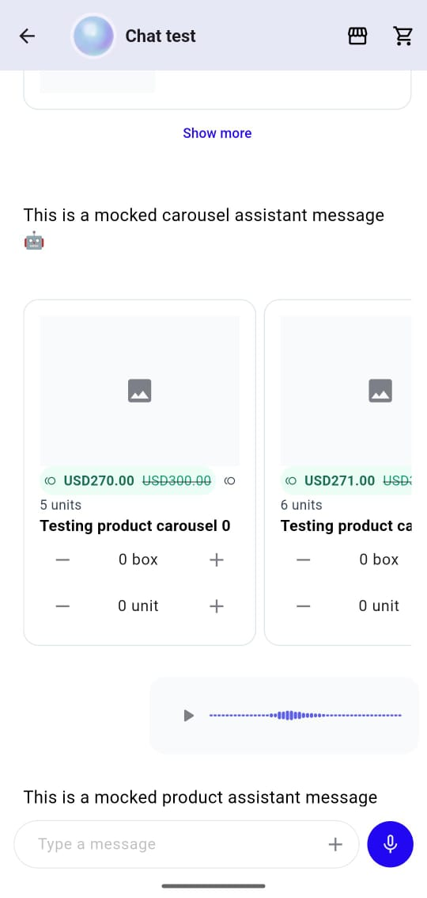

# Chat Flutter SDK

A Flutter package providing a complete chat UI solution for integrating with Yalo's messaging platform.



## Features

- Cross-platform (iOS, Android, Web)
- Customizable themes and styling
- Real-time messaging
- Photo and video attachments
- Voice messages
- Product messages and carousels
- Localization (English, Spanish)

## Installation

Add this to your package's `pubspec.yaml` file:

```bash
flutter pub token add "https://artifacts.yalo.ai/artifactory/api/pub/<REPO_NAME>" --env-var MY_SECRET_TOKEN

```

```yaml
dependencies:
  yalo_chat_flutter_sdk:
    hosted: https://artifacts.yalo.ai/artifactory/api/pub/<REPO_NAME>
    version: ^1.0.0
```

Or run

```bash
dart pub add yalo_chat_flutter_sdk --hosted https://artifacts.yalo.ai/artifactory/api/pub/<REPO_NAME>

```

### Message types

The SDK supports various message types:
- Text messages
- Image messages
- Video messages
- Voice messages
- Product messages and carousels
- Button messages
- CTA (call-to-action) messages


## Quick start

### 1. Initialize the SDK

```dart
import 'package:yalo_chat_flutter_sdk/yalo_sdk.dart';

void main() {
  WidgetsFlutterBinding.ensureInitialized();
  final YaloChatClient client = YaloChatClient(
    name: 'Chat name',
    channelId: 'your-channel-id',
    organizationId: 'your-organization-id',
    userId: 'optional-user-id', // Optional: identify the user with your own ID
  );
}
```

### 2. Add the Chat widget

```dart
class ChatScreen extends StatelessWidget {
  @override
  Widget build(BuildContext context) {
    return Chat(
      client: yaloChatClient,
      theme: ChatTheme(),
    );
  }
}
```

## Configuration

### YaloChatClient options

| Parameter | Type | Required | Description |
|-----------|------|----------|-------------|
| `name` | `String` | Yes | The chat name displayed in the header. |
| `channelId` | `String` | Yes | Your Yalo channel ID. |
| `organizationId` | `String` | Yes | Your Yalo organization ID. |
| `userId` | `String?` | No | Your own user identifier. When provided, the chat session is linked to your user. |

### Logging

Yalo Flutter SDK uses the [logging](https://pub.dev/packages/logging)
package. Enable logging by defining a root logger:

```dart
void main() {
  Logger.root.level = Level.ALL;
  Logger.root.onRecord.listen((record) {
    debugPrint(
      '${record.level.name}: ${record.time}: ${record.message} ${record.error ?? ''}',
    );
  });
}
```

## Commands

Commands let you handle client-to-channel actions locally instead of sending them through the default remote API. See the [Commands documentation](doc/commands.md) for the full list of available commands and usage examples.

## Theming

The widget can be fully customized with the `ChatTheme` class. See the [Theming API](doc/theming.md) for the complete list of color, text style, and icon properties.

## Examples

Check out the `/example` folder for a complete implementation example.

```bash
cd example
flutter run
```

## Requirements

- Flutter SDK: >=3.0.0
- Dart: >=3.0.0
- iOS: >=11.0
- Android: API level 21+

## Support

- https://support.yalo.com/

