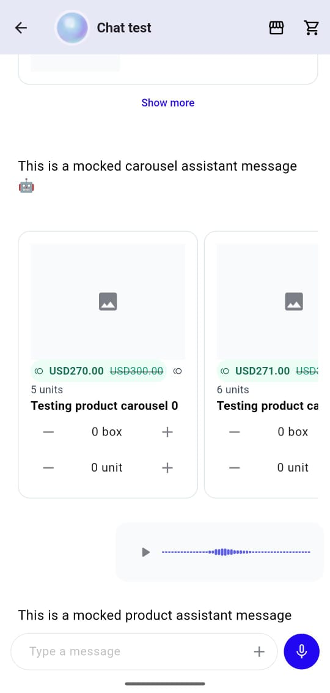

# Chat Flutter SDK

A Flutter package providing a complete chat UI solution for integrating with Yalo's messaging platform.



## Features

- 📱 Cross-platform (iOS, Android, Web)
- 🎨 Customizable themes and styling
- 💬 Real-time messaging
- 📸 Photo attachments support
- 🌐 i18n and l10n

## Installation

Add this to your package's `pubspec.yaml` file:

```bash
flutter pub token add "https://artifacts.yalo.ai/artifactory/api/pub/<REPO_NAME>" --env-var MY_SECRET_TOKEN

```

```yaml
dependencies:
  yalo_chat_flutter_sdk:
    hosted: https://artifacts.yalo.ai/artifactory/api/pub/<REPO_NAME>
    version: ^1.0.0
```

Or run

```bash
dart pub add yalo_chat_flutter_sdk --hosted https://artifacts.yalo.ai/artifactory/api/pub/<REPO_NAME>

```

### Message Types

The SDK supports various message types:
- Text messages
- Image messages
- Audio messages
- Product messages


## Quick Start

### 1. Initialize the SDK

```dart
import 'package:yalo_chat_sdk/yalo_chat_sdk.dart';

void main() {
  WidgetsFlutterBinding.ensureInitialized();
  final YaloChatClient client = YaloChatClient(
    flowKey: '1234567890',
  );
}
```

### 2. Add Chat Widget

```dart
class ChatScreen extends StatelessWidget {
  @override
  Widget build(BuildContext context) {
    return Chat(
      client: yaloChatClient,
      theme: ChatTheme(),
    );
  }
}
```

## Configuration

### App tool execution

If you want your agent to be able to execute tools inside your app,
like retrieving information already calculated by your app, or execute
custom code please refer to the [tool execution documentation](./docs/tool-execution.md)

### Logging

Yalo Flutter SDK uses the [logging](https://pub.dev/packages/logging)
package so you can enable logging by just defining a root logger like
the following


```dart
void main() {
  Logger.root.level = Level.ALL;
  Logger.root.onRecord.listen((record) {
    debugPrint(
      '${record.level.name}: ${record.time}: ${record.message} ${record.error ?? ''}',
    );
  });
}
```

### Theme Customization

All customization of the SDK is made by modifying the [Yalo ChatTheme
class](./lib/ui/theme), you can check the following image to know
what component each property modifies.


If you already have ThemeData in your project you can create a
ChatTheme from it using the constructor

```dart
ChatTheme.fromThemeData(themeData);
```

## Examples

Check out the `/example` folder for a complete implementation example.

```bash
cd example
flutter run
```

## Requirements

- Flutter SDK: >=3.0.0
- Dart: >=3.0.0
- iOS: >=11.0
- Android: API level 21+

## Support

- 📧 https://support.yalo.com/
